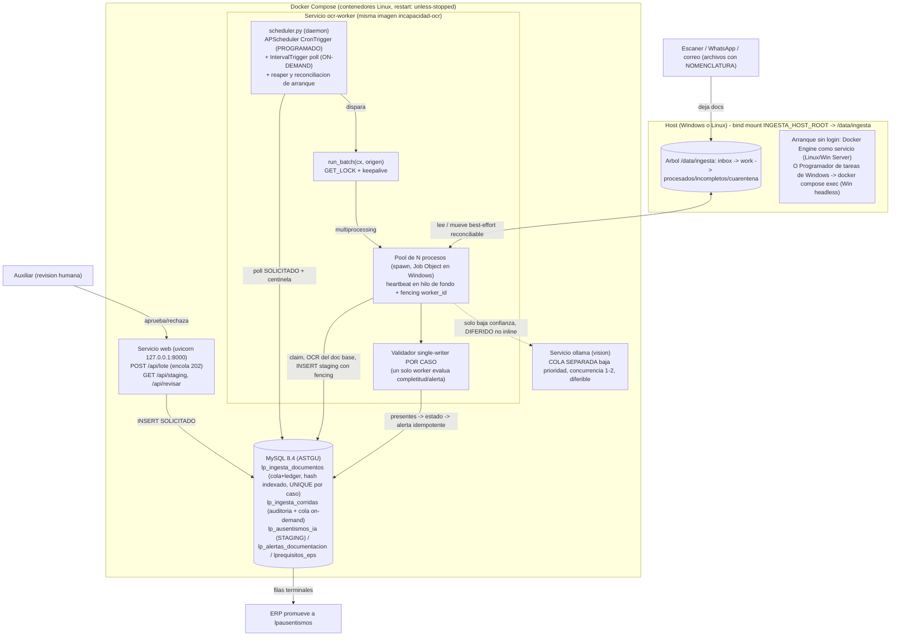

# Plan técnico: Ingesta masiva por lotes para `incapacidad-ocr`

## 1. Resumen ejecutivo

Un **runner de ingesta por lotes** dentro del paquete `incapacidad_ocr` toma imágenes/PDF de documentos de ausentismo desde una estructura de carpetas de "sin procesar", los procesa en masa (~7000 docs/mes, con ráfagas), agrupa los documentos de un mismo trámite por el **nombre del archivo**, valida que estén los soportes requeridos según el tipo de ausentismo y deja cada caso registrado en la tabla STAGING `lp_ausentismos_ia` para revisión humana, generando alertas sobre los casos incompletos.

Principios de diseño:

- **Reutiliza la librería en-proceso** (`IncapacidadProcessor` + `erp.mapear_a_staging` + `db.insertar_staging`), nunca la API HTTP ni SQL directo a `lpausentismos`. El batch **jamás auto-aprueba**: escribe en staging (`PENDIENTE_REVISION`), un auxiliar revisa y el ERP promueve.
- **Foco del OCR vs foco del sistema:** el OCR/extracción se concentra en el **documento base** (incapacidad/permiso/vacaciones); los **adjuntos se identifican por la nomenclatura del archivo** (no se OCR-ean). El sistema valida incapacidad **+ los adjuntos requeridos según el tipo de ausentismo que lee el OCR**.
- **Agrupación determinista por nomenclatura de archivos** `{cedula}_{AAAAMMDD}_{TIPODOC}[_NN].{ext}` (§3): el nombre indica el caso y el tipo de documento. La clasificación/agrupación por OCR queda como fallback para archivos mal nombrados.
- **MySQL es la fuente de verdad** del estado, la cola, el claim y la idempotencia (MySQL 8.4: claim con `SELECT ... FOR UPDATE SKIP LOCKED` + fencing por `worker_id`/`lease_token`, `GET_LOCK` con keepalive, hash indexado + `UNIQUE (caso_id, hash)`). El árbol de carpetas es **organización física best-effort y reconciliable**, nunca fuente de verdad ni mecanismo de lock.
- **Portabilidad Windows/Linux:** la lógica vive en **contenedores Linux** y corre idéntica en ambos SO; solo el mecanismo de arranque programado se elige según el host (§5).
- **100% local (Ley 1581):** ni documentos ni datos salen a internet; PII de salud tratada con `case_id` sin cédula en rutas/logs, volumen cifrado y ACL.

## 2. Arquitectura general



**Flujo de un documento (idempotente, reanudable, fenced):**

1. **Escaneo/encolado:** tras verificar estabilidad (§9.2) y `tamaño>0`, `hash = sha256(bytes)` → `INSERT IGNORE` en `lp_ingesta_documentos` con **UNIQUE `(caso_id, hash)`** e índice no único sobre `hash`. La llave de caso sale del **nombre** del archivo (§3). Re-soltar el mismo archivo en el mismo caso nunca duplica.
2. **Claim atómico fenced:** el worker reclama con `SELECT ... FOR UPDATE SKIP LOCKED LIMIT 1` + `UPDATE estado='EN_PROCESO', worker_id=?, lease_token=?, claimed_at=NOW(), heartbeat_at=NOW()`. Un **hilo de fondo** refresca `heartbeat_at` cada ~30 s durante el proceso.
3. **OCR del documento base:** solo los archivos con `TIPODOC` base (`INCAPACIDAD`/`PERMISO`/`VACACIONES`) se pasan a `IncapacidadProcessor`; obtiene tipo de ausentismo, cédula, fechas, CIE-10, EPS. Los adjuntos **no se OCR-ean** (se reconocen por su nombre).
4. **Escritura + checkpoint fenced (una sola transacción):** `db.insertar_staging_tx` (sin commit interno) y `UPDATE ... SET estado='HECHO', staging_id=? WHERE id=? AND worker_id=? AND lease_token=? AND estado='EN_PROCESO'`. Si `rowcount=0`, el worker perdió el lease → `ROLLBACK` + skip. Es la barrera dura contra la doble inserción.
5. **Completitud del caso (single-writer):** un **único escritor por caso**, bajo `GET_LOCK('caso_'||caso_id)`, evalúa `presentes`/`documentacion_estado`/alerta tras drenar los documentos del caso (§7.4).
6. **Movimiento físico (último paso, best-effort y reconciliable):** se escribe a `_tmp/` del volumen destino y luego `os.replace`. La correctitud vive en MySQL, no en el move; el estado del move (`estado_move ∈ {PENDIENTE_MOVER, MOVIDO}`) se reconcilia.

## 3. Nomenclatura de archivos (contrato de entrada)

Los documentos llegan **separados** (un archivo por documento). La agrupación y la clasificación se hacen de forma **determinista por el nombre del archivo**, que el feeder (escáner / quien recibe por WhatsApp o correo) aplica al guardar:

```
{cedula}_{AAAAMMDD}_{TIPODOC}[_NN].{ext}
```

| Parte | Significado | Reglas |
|---|---|---|
| `cedula` | Identificación del empleado (solo dígitos) | Llave de agrupación (con la fecha). |
| `AAAAMMDD` | Fecha del trámite: inicio de la incapacidad; si el feeder no la conoce, la de recepción. **Igual en todos los archivos del mismo trámite**. | El sistema re-lee la fecha real por OCR de la incapacidad; si difiere, marca `requiere_revision`. |
| `TIPODOC` | Tipo de documento (vocabulario controlado) | Insensible a mayúsculas; se normaliza. |
| `NN` | (opcional) 2 dígitos si hay varios del mismo tipo | `_01`, `_02`, … |
| `ext` | `pdf` \| `jpg` \| `jpeg` \| `png` | |

**Llave de caso** = `{cedula}_{AAAAMMDD}`. Todos los archivos con la misma llave forman un trámite.

**Vocabulario `TIPODOC`:**
- **Base (uno por caso — el ÚNICO que se OCR-ea/extrae):** `INCAPACIDAD` · `PERMISO` · `VACACIONES`.
- **Adjuntos (solo se verifican por nombre; no se OCR-ean):** `FURAT` · `FURIPS` · `EPICRISIS` · `HISTORIA` · `NACIDOVIVO` · `REGISTROCIVIL` · `DEFUNCION` · `CEDULA` · `FORMULA` · `ORDEN` · `OTRO`.

**Ejemplos:**
```
Accidente de trabajo (empleado 1005542119, inicio 09/06/2026):
  1005542119_20260609_INCAPACIDAD.pdf
  1005542119_20260609_FURAT.pdf
Licencia de maternidad:
  1023456789_20260701_INCAPACIDAD.pdf
  1023456789_20260701_HISTORIA.pdf
  1023456789_20260701_NACIDOVIVO.pdf
```

**Cotejo de seguridad:** la cédula del nombre se compara con la que el OCR lee de la incapacidad; si no coinciden → `requiere_revision`. **Nunca se cruzan cédulas distintas** en un mismo caso.

**PII en el nombre (Ley 1581):** la cédula aparece en el nombre **de entrada** (carpeta `inbox`, transitoria, con ACL y volumen cifrado). Al mover a `procesados/`, el sistema **renombra a nombres sin PII** (`NN_<tipo>.<ext>` bajo `case_id` sin cédula, §4.2/§4.4) y los logs redactan la cédula.

**Archivos que no siguen la convención → `inbox/sin_nomenclatura/`:** el sistema intenta (a) clasificar por OCR (§7.2) y (b) auto-agrupar por la cédula+fecha leídas del documento dentro de una ventana `±N días`; si sigue ambiguo → bucket de revisión humana (nunca se fuerza a un caso ni se cruzan cédulas). El camino primario y determinista es la nomenclatura.

## 4. Estructura de carpetas y máquina de estados

### 4.1 Árbol de directorios (acortado para MAX_PATH)

Todo cuelga de `/data/ingesta` (bind mount del host). El estado autoritativo vive en MySQL; el árbol refleja el avance físico y es reconstruible. El árbol destino se acorta agresivamente porque las rutas las consumen herramientas del host Windows (Explorer, antivirus, backup) donde MAX_PATH=260 aplica y el prefijo `\\?\` no es emitible desde el contenedor Linux.

```
/data/ingesta/                         # INGESTA_ROOT (bind mount INGESTA_HOST_ROOT)
├── inbox/                             # CONTRATO DE ENTRADA: archivos con NOMENCLATURA (§3).
│   ├── whatsapp/  correo/  original/  #   subarbol -> deriva estado_recepcion (§7.7); RH puede
│   │   └── {cedula}_{AAAAMMDD}_{TIPODOC}[_NN].{ext}  #   crear mas subcarpetas: el escaneo es RECURSIVO
│   └── sin_nomenclatura/              # archivos mal nombrados -> fallback OCR + revision (§3)
├── work/                             # area interna (mismo volumen)
│   ├── recepcion/                    # estabilidad verificada + saneo de nombres
│   ├── procesando/<instancia>/       # en OCR (claim real en MySQL)
│   └── validando/                    # doc base listo, evaluando requisitos del caso
├── procesados/<Nombre persona>/<AAAA>/<MM>/<DD>/   # COMPLETOS, organizados por persona y fecha (§4.2)
├── incompletos/<Nombre persona>/<AAAA>/<MM>/<DD>/  # falta doc requerido; espera adjuntos con deadline
├── cuarentena/<case_id>/             # fallo tecnico -> retry/diagnostico
├── duplicados/<yyyymm>/              # hash ya visto EN EL MISMO CASO (auditoria breve)
├── archivo/<yyyymm>.zip              # retencion fria comprimida (respeta retencion LEGAL, §9.4)
├── _tmp/                             # escrituras temporales EN EL VOLUMEN DESTINO (siempre)
├── _control/                         # centinela on-demand (encola fila SOLICITADO, no auto-borra)
└── logs/ingesta-YYYYMMDD.ndjson      # journal SIN PII (sin cedula)
```

**Regla de oro:** una transición nunca escribe "in situ". Se escribe SIEMPRE a `_tmp/` del volumen destino y luego **un** `os.replace`. Un crash deja el caso en **exactamente una** carpeta o, a lo sumo, un archivo en `_tmp/` sin fila (reconciliable). Los nombres destino son cortos: `NN_<tipo>.<ext>` donde `NN` viene de una fuente serializada (§4.4).

### 4.2 Identidad del caso (sin PII en la ruta)

`case_id = <yyyymmdd>-<shorthash>` — p.ej. `20260721-a1b2c3d4`.
- `yyyymmdd`: fecha de entrada (bucketiza por día/mes).
- `shorthash`: 8 hex derivados del contenido/semilla del caso (unicidad).
- La **cédula nunca se embebe en `case_id`**: el vínculo `case_id→cédula/idlpempleado` vive solo en la BD con ACL. El auxiliar ve la cédula en la UI leída de la BD, no en el nombre de carpeta ni en el log.
- Siempre ASCII, minúsculas, `[a-z0-9-]`, sin nombres reservados de Windows (CON/PRN/AUX/NUL/COM1-9/LPT1-9), sin punto/espacio final, corto para MAX_PATH.

**Organización de `procesados/` e `incompletos/` (para RH):** a diferencia del `case_id` interno, las carpetas de salida se organizan de forma **navegable por RH**: `<Nombre persona>/<AAAA>/<MM>/<DD>/`, donde el nombre es **primer nombre + primer apellido** (tomado de la incapacidad vía el catálogo — `extract.primer_nombre_apellido` sobre el nombre canónico resuelto por cédula) y la fecha es la de **inicio de la incapacidad**. Así RH ve el historial de ausentismos de una persona de un vistazo. Es una decisión de producto para el caso de uso de RH: el nombre es PII, pero se acepta en la ruta sobre un volumen **local, con ACL y cifrado**; la **cédula y el diagnóstico NO** van en la ruta (siguen solo en la BD). El saneo del nombre de carpeta (ASCII, sin caracteres inválidos, longitud acotada) evita problemas de FS/MAX_PATH.

### 4.3 Máquina de estados (caso = carpeta física; estado autoritativo = MySQL)

```
RECIBIDO(inbox) --estable+dedup(caso,hash)--> ESTABLE(recepcion) --parse nombre / OCR base--> CLASIFICADO
      | dup en mismo caso                                                                    | llave de caso del nombre (§3)
      v                                                                                      v
  DUPLICADO(duplicados)                                                             AGRUPADO (caso_id resuelto)
                                                                                             | claim fenced (SKIP LOCKED)
                                                                                             v
                                                                                 PROCESANDO(procesando/<instancia>)
                                                                                             | drenados TODOS los docs del caso
                                                                                             v
                                                                             VALIDANDO (single-writer por caso, §7.4)
                        +----------------------------------------------------------------------+-------------------------------+
                        v                                                                      v                               v
              COMPLETO(procesados)                                            INCOMPLETO(incompletos)                     ERROR(cuarentena)
    (INSERT staging PENDIENTE_REVISION,                        (INSERT staging PENDIENTE_REVISION,           (fallo tecnico; retry backoff;
     documentacion_estado=COMPLETA)                             doc_estado=INCOMPLETA + ALERTA;               escalada a Ollama DIFERIDA)
                        | cierre revision + gracia + retencion LEGAL          | adjunto tardio -> re-AGRUPADO (transaccion §7.1)
                        v                                                     | vence deadline -> queda INCOMPLETO (visible al auxiliar)
                 ARCHIVADO(archivo, comprimido, NO purgado bajo plazo legal)
```

La revisión humana **no** es un estado de carpeta: ocurre en `lp_ausentismos_ia` vía la UI. Tanto `COMPLETO` como `INCOMPLETO` insertan en staging (`PENDIENTE_REVISION`); la diferencia es `documentacion_estado`/`documentos_faltantes` + alerta. Si llega un adjunto tardío y la fila ya está `APROBADO`/`RECHAZADO`, **no se muta** la fila terminal; se crea alerta/nueva revisión. Los casos `INCOMPLETO` con deadline vigente **bloquean la aprobación** en la UI ("esperando soportes hasta DD/MM").

### 4.4 Nombres de archivo dentro del caso (sin colisión)

El contador `NN` de `NN_<tipo>.<ext>` se deriva de una **fuente serializada** (columna `secuencia_caso` en el ledger bajo el lock del caso, o del `doc_id`/`hash`), no lo eligen workers independientes. El `os.replace` destino **debe fallar si el nombre ya existe** (no sobre-escribir); una colisión inesperada manda a cuarentena.

## 5. Programación cron + on-demand multiplataforma (Windows/Linux)

La lógica (scheduler, workers, locks) vive **dentro de contenedores Linux** y corre idéntica en ambos SO. La garantía de que el contenedor esté vivo tras un reboot depende del host; el mecanismo de arranque se elige según el host:

| Host | Arranque y disparo programado |
|---|---|
| **Linux** | `docker compose` con `restart: unless-stopped` + `systemctl enable docker`. El daemon **APScheduler dentro del contenedor** dispara. Sin cron nativo. |
| **Windows Server con Docker Engine/containerd como servicio** | El contenedor arranca sin login (servicio de sistema). APScheduler dentro del contenedor dispara igual que en Linux. **Camino preferido en Windows.** |
| **Windows headless solo con Docker Desktop** | Docker Desktop no levanta sin sesión iniciada → se usa el **Programador de tareas de Windows** (corre como `SYSTEM`, arranca sin login): (a) *At startup* → `docker compose up -d`; (b) *diario* → `docker compose exec -T ocr-worker python -m incapacidad_ocr.batch run --once`. |

> **Pendiente de definir en despliegue:** el SO del host (Windows Server vs Linux). Afecta **solo** esta sección; el resto del sistema es idéntico. Al fijar el host se valida con un **reinicio en frío sin login** que confirme que el worker levanta y el lote se dispara.

### 5.1 El scheduler (`batch/scheduler.py`)

`BackgroundScheduler` de APScheduler con dos jobs y un solo callback:
- `CronTrigger` desde `INGESTA_CRON` (default `0 2 * * *`) con `timezone=BATCH_TZ` (`America/Bogota`), `coalesce=True`, `misfire_grace_time=3600`, `max_instances=1`.
- `IntervalTrigger` cada `BATCH_POLL_SECONDS` (default 30 s): revisa filas `SOLICITADO` en `lp_ingesta_corridas` y el centinela.

```python
def disparar(origen):
    with db.conexion_mysql() as cx:
        cur = cx.cursor()
        cur.execute("SELECT GET_LOCK('incapacidad_ocr_batch', 0)")  # 0 = no bloquear
        if cur.fetchone()[0] != 1:
            log.info("Lote ya en curso; se omite disparo %s", origen); return
        keepalive = iniciar_keepalive(cx)   # SELECT 1 cada ~60 s: evita que wait_timeout reape la sesion ociosa
        try:
            run_batch(cx, origen)
        finally:
            keepalive.detener()
            cur.execute("SELECT RELEASE_LOCK('incapacidad_ocr_batch')")
```

La conexión que sostiene `GET_LOCK` queda ociosa durante todo el drain; el **keepalive** (`SELECT 1` cada ~60 s) evita que `wait_timeout`/proxy la corte y libere el lock, provocando un drain solapado. La defensa dura contra el doble drain es igualmente el **claim fenced** (§6.4).

### 5.2 On-demand — 3 vías, todas ENCOLAN (no ejecutan en el handler)

1. **Endpoint** `POST /api/lote` (servicio `web`, `127.0.0.1:8000`): inserta `lp_ingesta_corridas(disparo='ON_DEMAND_API', estado='SOLICITADO')` y responde **202** con el `id`. `GET /api/lote/{id}` da progreso para el botón "Procesar ahora".
2. **CLI:** `docker compose exec ocr-worker python -m incapacidad_ocr.batch run --once`.
3. **Archivo centinela:** soltar un archivo en `/data/ingesta/_control/`. El poll **inserta una fila `SOLICITADO`** y solo entonces borra el centinela (si el drain ya está en curso, la solicitud sobrevive como fila y se encadena).

Trigger por **poll**, no watchdog/inotify: las APIs de eventos de FS divergen por SO y no son fiables cruzando el bind-mount; un `stat` cada 30 s es trivial y portable.

### 5.3 Recuperación tras caída/reinicio

- Supervisión por `restart: unless-stopped` + arranque del runtime al boot según el host.
- **Reconciliación de arranque** (§6.4): marca filas `EN_PROCESO` huérfanas como reencolables; **reintenta los `HECHO` con `estado_move=PENDIENTE_MOVER`** (archivos varados en `work/`).
- **Procesos worker en Windows:** se crean en un **Job Object** con `JOB_OBJECT_LIMIT_KILL_ON_JOB_CLOSE` (mueren con el padre); además cada worker verifica su `lease_token`/generación en cada claim y se autotermina si caducó.

## 6. Procesamiento masivo (workers, cola, idempotencia, escala)

### 6.1 Modelo de ejecución

`run_batch()` arranca un **pool de procesos persistentes** (`multiprocessing` con `set_start_method('spawn')` en ambos SO; en Windows dentro de un Job Object). Procesos, no hilos, porque RapidOCR/ONNXRuntime es CPU-bound.

**`initializer` de cada worker** (una vez por proceso):
1. Fija `OMP_NUM_THREADS=1` e `intra_op_num_threads=1` **antes de importar rapidocr**.
2. Construye un `IncapacidadProcessor(RapidOCRBackend(), RuleBasedExtractor())`.
3. Abre una conexión MySQL con statement-timeout (`MAX_EXECUTION_TIME`) y un `erp.Lookups(cx)`.

**Loop del worker:** reclamar (fenced) → iniciar heartbeat en hilo de fondo → si es documento base, `processor.run(ruta)`; si es adjunto, solo registrar tipo → `mapear_a_staging` (solo el caso base) → checkpoint fenced en 1 transacción → detener heartbeat → mover (best-effort). Se recicla cada ~500 docs (`maxtasksperchild`) con watchdog de RSS (psutil, umbral ~2 GB).

**Resiliencia de conexión:** ante `OperationalError`/socket muerto (reinicio de BD, `wait_timeout`, failover), el worker reconstruye la conexión y el `Lookups` antes de reintentar el doc; hace `ping`/reset tras inactividad; el statement-timeout impide que un claim/insert colgado bloquee al worker.

### 6.2 Cap de hilos ONNX a 1 por worker

Con N workers y sesiones ONNX usando todos los cores se produce N×cores hilos y *thrash*. Con 1 hilo/worker el throughput escala casi lineal. Se valida en el benchmark que docs/seg escala al añadir workers.

### 6.3 Cola + idempotencia = tabla ledger en MySQL

**`lp_ingesta_documentos`** es la cola durable y la fuente del claim. El escáner recorre `inbox/`, verifica estabilidad y `tamaño>0` (§9.2), calcula `hash=sha256(contenido)` y hace `INSERT IGNORE` con **UNIQUE `(caso_id, hash)`** (dedup dentro del caso) + índice no único sobre `hash`.

**Claim (con índice compuesto obligatorio):**
```sql
-- indice: (estado, prioridad, caso_id, id) -> range-scan de una fila, sin filesort
SELECT id, ruta_actual, caso_id, tipo_doc FROM lp_ingesta_documentos
WHERE estado='PENDIENTE'
ORDER BY prioridad, caso_id, id
LIMIT 1 FOR UPDATE SKIP LOCKED;
-- luego: UPDATE ... SET estado='EN_PROCESO', worker_id=?, lease_token=?, claimed_at=NOW(), heartbeat_at=NOW()
```
Sin el índice compuesto, cada claim haría filesort sobre todo el backlog `PENDIENTE`. **Backoff cuando el claim devuelve vacío** (evita spin de los workers sobre una cola casi vacía).

**Prioridad del documento base:** `prioridad` (0 = base/incapacidad, 1 = adjuntos) sesga el orden pero no garantiza orden estricto por caso. Por eso la completitud **no** se calcula por documento; se calcula una vez por caso, single-writer, tras drenar el caso (§7.4).

### 6.4 Checkpointing, reintentos, fencing y reanudabilidad

- **Commit por documento fenced en una única transacción:** `insertar_staging_tx` (sin commit) + `UPDATE ... SET estado='HECHO', staging_id=?, estado_move='PENDIENTE_MOVER' WHERE id=? AND worker_id=? AND lease_token=? AND estado='EN_PROCESO'`. `rowcount=0` → `ROLLBACK` + skip. Barrera dura contra la doble inserción en staging.
- **Heartbeat en hilo de fondo** cada ~30 s durante el proceso (un PDF de 20 páginas o una escalada a Ollama supera el TTL en una sola llamada síncrona).
- **Reaper** con **TTL > (peor caso medido de un doc + timeout de Ollama + margen)**: reencola `EN_PROCESO` con `heartbeat_at` vencido, `intentos+1`, tope → `CUARENTENA`.
- **Reconciliación de arranque:** filas huérfanas + reintento de moves pendientes (`estado_move=PENDIENTE_MOVER`).

### 6.5 Extractor `rule` en el hot path; Ollama diferido

El lote usa `extractor='rule'` (determinista) sobre el documento base. Los documentos de baja confianza o con **base ilegible** no se re-OCR-ean con Ollama de forma inline: se marcan y se **encolan en una cola separada de baja prioridad** hacia Ollama (`cola_ollama.py`), con concurrencia 1–2 y timeout agresivo; un fallo/lentitud de Ollama nunca bloquea el hot path.

### 6.6 Dimensionamiento

`W = min(cores − 1, floor(RAM_libre_GB / 1.0))`, reservando 1 core + 2–4 GB si MySQL es local. El presupuesto de RAM se calcula con el peor caso de PDF multipágina (§6.8): un bundle grande a scale 3.0 materializado entero superaría 1 GB/worker → se procesa en **streaming**.

| Cores | Workers | Throughput (rule, RapidOCR, 1–3 pág, ~2–4 s/doc/core) | Referencia |
|---|---|---|---|
| 8 | 6 | ~1.5–2 docs/s → ~6–7k docs/hora | 7000/mes en ~1 h; ráfaga de 1500 en ~12–15 min |
| 16 | 12 | ~3–4 docs/s | Escala casi lineal |

El benchmark inicial (100 docs representativos + bundles multipágina reales) mide docs/seg y RSS por worker; los números de arriba son referencia, no compromiso.

### 6.7 Escalado vertical y horizontal

- **Vertical (default):** más workers en el pool.
- **Horizontal (opcional, `INGESTA_MULTI_HOST=1`):** varias instancias apuntando a la MISMA carpeta y BD. `SKIP LOCKED` + `(caso_id,hash)` + fencing garantizan no pisarse; `instancia_id=hostname+pid`. En este modo se **desactiva** `GET_LOCK('incapacidad_ocr_batch')` (coalescing single-host); `GET_LOCK('ingesta_scan')` y `GET_LOCK('caso_...')` siguen. `max_connections` ≥ Σ(workers) + margen.

### 6.8 PDFs multipágina: streaming y truncamiento explícito

- `MAX_PDF_PAGES` es parametrizable (elevable para un documento base largo) y **registra explícitamente** cuando trunca (nunca en silencio), enviando esos casos a revisión.
- El rasterizado se hace **página a página en streaming** (rasterizar → OCR → liberar), no materializando el bundle completo; el presupuesto de RAM/worker se recalcula con el peor caso medido.

## 7. Agrupación, clasificación y validación de requisitos por tipo

### 7.1 Agrupación del trámite

La agrupación es por la **llave de caso `{cedula}_{AAAAMMDD}` del nombre** (§3), sin OCR. Los adjuntos con la misma llave se asocian al caso del documento base.

**Transacción de re-agrupación (adjunto tardío):** cuando un adjunto llega después y debe unirse a un caso existente:
- Se toma `GET_LOCK('caso_'||caso_id_destino)` → reasignación atómica de `caso_id` en el ledger del adjunto (UPDATE fenced) → re-evaluación single-writer de la completitud del caso (§7.4) → move del archivo a la carpeta del caso (best-effort, `estado_move`).
- La reasignación respeta el fencing; un adjunto `EN_PROCESO` no se reasigna hasta liberar su lease.
- Si la fila de staging del caso ya está terminal (`APROBADO`/`RECHAZADO`): no se muta; se genera alerta/nueva revisión (§7.6).

**Fallback (archivos sin nomenclatura):** auto-agrupación por cédula+ventana leída del documento; ante ambigüedad o cédula ilegible → bucket de revisión, nunca forzar un caso ni cruzar cédulas.

### 7.2 Clasificación de documentos — primaria por nombre, OCR como fallback

Con la nomenclatura, **el tipo de cada archivo se lee de su nombre** (`TIPODOC`): determinista, 100% local y sin coste de OCR para los adjuntos. El OCR se reserva para el documento base (extracción de datos, no clasificación).

**Fallback por OCR** (solo `sin_nomenclatura/` o `TIPODOC` no reconocible): clasificación por texto (regex sobre OCR), reproducible y auditable (guarda `evidencia`). Si un PDF trae varios documentos juntos, se clasifica por página (requiere el texto por página, `read_pages()`, §8.2 — mejora opcional). El catálogo de anclas normaliza también los `TIPODOC` del nombre a códigos canónicos.

**Núcleo (de `extract.py`):** `INCAPACIDAD`, `PERMISO`, `VACACIONES`.

**Catálogo canónico de adjuntos (`clasificador.py`) — tokens `TIPODOC` (nombre) y anclas de texto (fallback):**

| Código canónico | Anclas de texto (normalizadas, tolerando OCR pegado) | Peso |
|---|---|---|
| `EPICRISIS` | `epicrisis`, `resumen de atencion`, `resumen de egreso`, `nota de egreso`, `hoja de egreso` | alto |
| `HISTORIA_CLINICA` | `historia clinica`, `nota de evolucion`, `evolucion medica`, `consulta externa`, `registro de atencion` | medio |
| `FURAT` | `furat`, `reporte de accidente de trabajo`, `formato unico de reporte de accidente` | alto |
| `FURIPS` | `furips`, `accidente de transito`, `reporte…soat` | alto |
| `CEDULA` | `cedula de ciudadania`, `registraduria nacional`, `numero unico de identificacion`, `nuip` | alto |
| `CERTIFICADO_NACIDO_VIVO` | `certificado de nacido vivo`, `antecedente para el registro civil`, `nacido vivo` | alto |
| `REGISTRO_CIVIL_NACIMIENTO` | `registro civil de nacimiento`, `indicativo serial`, `serial del registro` | alto |
| `CERTIFICADO_DEFUNCION` | `certificado de defuncion`, `defuncion` | alto |
| `FORMULA_MEDICA` / `ORDEN_MEDICA` | `formula medica`, `orden medica`, `prescripcion`, `autorizacion de servicios` | bajo |
| `NO_CLASIFICADO` | (ninguna ancla supera el umbral, u OCR vacío) → bucket de revisión | — |

`clasificar_texto(texto)`: normaliza, suma pesos, elige el de mayor score si supera `_UMBRAL_SCORE`; empate/por debajo/OCR vacío → `NO_CLASIFICADO`.

`presentes` = ∪ de los `TIPODOC` de **todos los archivos del caso** (leídos del nombre; por OCR solo en el fallback).

### 7.3 Tipo de ausentismo del caso

Del documento **base** vía `erp.mapear_a_staging()` (permiso→7/12, vacaciones→13, SOAT→11, resto `homologar_tipo`, default 3). No se homologa sobre adjuntos. Caso sin documento base → tipo indeterminado: INCOMPLETO con faltante `INCAPACIDAD` + alerta; nunca se inventa.

### 7.4 Validación de requisitos — single-writer por caso

`erp.validar_documentacion(presentes, id_entidad, id_tipo, lookups)` cruza el conjunto **real** de tipos presentes contra los requeridos.

**Ejecución single-writer:** la evaluación de `presentes → documentacion_estado → alerta` se hace **una sola vez por caso**, por un único escritor que sostiene `GET_LOCK('caso_'||caso_id)`, **tras drenar todos los documentos del caso**. Así `presentes` se lee de datos ya commiteados y no hay *lost update*.

- **Fuente autoritativa:** `lprequisitos_eps` por `idlpentidad+idlptipoausentismo`, leyendo también `obligatorio` (solo `obligatorio=1` marca INCOMPLETA).
- **Respaldo `REQUISITOS_DEFAULT`** (entidad-agnóstico) si la tabla no tiene filas:

| id | Tipo | Requeridos (default; la tabla manda) |
|---|---|---|
| 2 | Accidente de trabajo | `INCAPACIDAD` + `FURAT` |
| 3 | Enfermedad general | `INCAPACIDAD` + soporte clínico |
| 5 | Licencia maternidad | `INCAPACIDAD` + `HISTORIA_CLINICA` + (`CERTIFICADO_NACIDO_VIVO` \| `REGISTRO_CIVIL_NACIMIENTO`) |
| 7 | Licencia no remunerada | `PERMISO` |
| 8 | Enfermedad laboral | `INCAPACIDAD` + `FURAT` |
| 9 | Licencia paternidad | `INCAPACIDAD` + (`REGISTRO_CIVIL_NACIMIENTO` \| `CERTIFICADO_NACIDO_VIVO`) |
| 10 | Prelicencia | `INCAPACIDAD` |
| 11 | Tránsito no laboral | `INCAPACIDAD` + `FURIPS` |
| 12 | Licencia remunerada | `PERMISO` |
| 13 | Vacaciones | `VACACIONES` |

*(Valores a confirmar con Diana; la tabla `lprequisitos_eps` siempre prevalece.)*

- **Grupos de equivalencia (`EQUIVALENCIAS_DOC`):** soporte clínico = `{EPICRISIS, HISTORIA_CLINICA, RESUMEN_ATENCION}`; nacimiento = `{CERTIFICADO_NACIDO_VIVO, REGISTRO_CIVIL_NACIMIENTO}`.
- **Mínimo siempre:** el documento base en `presentes`.
- **Resultado:** `documentacion_estado ∈ {COMPLETA, INCOMPLETA, NO_EVALUADA}` (`NO_EVALUADA` si no se pasó `presentes` — degradación segura, nunca falso COMPLETA).

### 7.5 Anti-fabricación

- OCR de página `< MIN_OCR_CHARS` → `NO_CLASIFICADO`; no cuenta como presente ni se adivina tipo.
- El nombre de archivo NUNCA satisface un requisito por sí solo más allá de identificar el tipo declarado; el documento base sí se verifica por OCR.
- `NO_CLASIFICADO` no marca "completo" ni fuerza "incompleto" a ciegas: queda "presente sin clasificar" para que el revisor asigne tipo.

### 7.6 Estado, alertas idempotentes y adjuntos tardíos vs revisión humana

- Se rellenan `documentacion_estado` y `documentos_faltantes` (en TEXT/códigos cortos, §9.7).
- **Alertas:** `db.upsert_alerta_por_caso` escribe en `lp_alertas_documentacion` cuando el caso queda INCOMPLETO. Idempotente (upsert por `id_ausentismo_ia`, índice único). Si el caso pasa a COMPLETO, la alerta se cierra (`RESUELTA`).
- **Carrera revisión ↔ adjuntos tardíos:** los `INCOMPLETO` con deadline vigente bloquean la aprobación en la UI; un adjunto sobre fila terminal → alerta/nueva revisión, nunca mutación silenciosa de `lpausentismos`.
- **Dedup semántica:** además del hash (mismo archivo), un **aviso no bloqueante** en staging por clave natural (`idlpempleado + fechainicio + Numerodias + idlptipoausentismo`) marca "posible duplicado del id X" — un mismo documento reenviado por WhatsApp se re-comprime (bytes distintos → hash distinto). El aviso lo resuelve el auxiliar.

### 7.7 Estado de recepción por sub-árbol

`estado_recepcion` se deriva por sub-árbol/convención de carpeta (`inbox/whatsapp/`, `inbox/correo/`, `inbox/original/`), con default `WHATSAPP` y override por caso; así el flag `original` e `idlpestadosrecepausentismos` no quedan mal etiquetados.

## 8. Integración con `incapacidad-ocr` y flujo de revisión humana

### 8.1 Qué se reutiliza (por LIBRERÍA, no por API HTTP)

Misma imagen Docker, en-proceso:
- `IncapacidadProcessor(ocr_backend, extractor).run(path)`, RapidOCR cargado una vez por worker.
- `erp.Lookups(cx)` + `erp.mapear_a_staging(...)` → `row` con `estado="PENDIENTE_REVISION"`, `documentacion_estado`, `documentos_faltantes`, `requiere_revision`, `campos_faltantes`.
- `db.insertar_staging(cx, row)` / `insertar_staging_tx(cur, row)` para escribir en `lp_ausentismos_ia`.

Nunca se toca `lpausentismos`; el batch jamás auto-aprueba. La API HTTP no se usa para el lote (hop de red que serializa PII, sin agrupación/movimiento/cuarentena, acopla throughput a uvicorn).

### 8.2 Cambios necesarios en el core

| Módulo | Cambio | Motivo |
|---|---|---|
| `db.py` | `insertar_staging_tx(cur, row)` **sin commit interno** | Checkpoint fenced por doc controlado por el worker. |
| `db.py` | `crear_conexion` con **statement-timeout** + reconexión/ping; `upsert_alerta_por_caso` | Resiliencia de conexión persistente; escribir alertas. |
| `db.py` | Claim/checkpoint **fenced por `worker_id`+`lease_token`**; UNIQUE `(caso_id, hash)`; aviso dedup semántica | Anti doble-inserción, dedup correcta. |
| `erp.py` | `REQUISITOS_DEFAULT`, `EQUIVALENCIAS_DOC`, `validar_documentacion(...)` single-writer | Validación real por contenido del caso. |
| `erp.py` | `mapear_a_staging(..., documentos_presentes=None)` → degrada a `NO_EVALUADA` | Evita falso COMPLETA. |
| `erp.Lookups` | `requisitos_documentales(id_ent, id_tipo)` → `(documento_normalizado, obligatorio)` | Hoy ignora `obligatorio`. |
| `clasificador.py` (nuevo) | Vocabulario `TIPODOC` + parseo de nombre + `clasificar_texto` (fallback) | Clasificación por nombre (primaria) y por OCR (fallback). |
| `sql/init.sql` | Ampliar `archivo_origen`/`documentos_faltantes` a **TEXT / códigos cortos**; validar longitud antes del INSERT | Rutas/listas largas exceden VARCHAR(255). |
| `ocr.py`/`processor.py` | **`read_pages()` (opcional)**: exponer `paginas=[(idx, texto)]` | Solo para el fallback (PDF que mezcle documentos). Con nomenclatura no se usa en el hot path. |

### 8.3 Subpaquete nuevo `incapacidad_ocr/batch/`

| Submódulo | Responsabilidad |
|---|---|
| `config.py` | Config tipada CLI > env > TOML > defaults; reutiliza `db.db_config()`; secretos solo por env; fail-fast. |
| `scheduler.py` | Daemon APScheduler (Cron + poll) cuando corre en contenedor; callback con keepalive del lock; reaper y reconciliación de arranque. |
| `runner.py` | Punto de entrada único: escanear → agrupar por nombre → pool → evaluación single-writer por caso → consolidar. |
| `escaner.py` | Recorre `inbox/`, verifica estabilidad+tamaño, `sha256`, `INSERT IGNORE` `(caso_id,hash)`, **parseo de nomenclatura → llave de caso + tipo**, prioridad; `GET_LOCK('ingesta_scan')`. |
| `worker.py` | Proceso persistente (Job Object en Windows): initializer, loop reclamar(fenced)→heartbeat-bg→(OCR si base)→map→checkpoint fenced→mover; reconstruye conexión ante socket muerto; recicla cada N docs. |
| `claim.py` | `SKIP LOCKED` + `UPDATE EN_PROCESO` con `worker_id`+`lease_token`; verifica generación de corrida. |
| `caso.py` | Modelo del caso, agrupación por llave del nombre, transacción de re-agrupación bajo `GET_LOCK('caso_...')`; fallback por OCR. |
| `clasificador.py` | Parseo de `TIPODOC` del nombre → código canónico; clasificación por OCR de fallback. |
| `validador.py` | Single-writer por caso: `presentes`→`validar_documentacion`→staging + alerta idempotente. |
| `layout.py` | Árbol acortado, rutas por estado, saneo multiplataforma, `case_id` sin cédula, nombres `NN_<tipo>` desde fuente serializada. |
| `fs_atomico.py` | Escribir SIEMPRE a `_tmp/` + `os.replace`; move best-effort con `estado_move`; reintentos ante `WinError 32`; reconciliación de moves. |
| `cola_ollama.py` | Cola separada de baja prioridad hacia Ollama, concurrencia 1–2, diferible. |
| `recuperacion.py` | Reaper/reconciliación (doc, corrida, moves pendientes) por lease/heartbeat. |
| `retencion.py` | Archivado/purga separando retención operativa de legal (§9.4). |
| `observ.py` | Log JSON rotado sin PII + resumen por corrida. |
| `cli.py` | `python -m incapacidad_ocr.batch [run] [--once|--daemon] [--dry-run] [--dir ...] [--workers N]`. |

## 9. Robustez, errores, configuración, seguridad/PII, observabilidad

### 9.1 Clasificación de desenlaces

| Clase | Ejemplos | Acción |
|---|---|---|
| **Transitorio** | DB timeout, socket MySQL muerto, deadlock, IO | Reintento: 3 intentos, backoff exponencial base 2 s ×2 tope 30 s + jitter; socket muerto → reconstruir conexión. Agotados → cuarentena con sidecar `.error.json` (sin PII). |
| **Permanente** | PDF corrupto, formato no soportado, OCR base `< MIN_OCR_CHARS` | Cuarentena directa. Base ilegible → escalada a Ollama diferida (cola separada) antes de rendir. |
| **Datos incompletos (no es error)** | Faltan campos / falta un documento requerido | Staging `PENDIENTE_REVISION` con `problemas`/`documentos_faltantes` + alerta. Es el propósito de staging. |

Un **adjunto legítimo** (sin documento base) se asocia al caso y se enlaza en el ledger, sin fila en staging ni error; la validación single-writer del caso decide la completitud.

### 9.2 Estabilidad de archivos y movimiento

- **Estabilidad no solo por size+mtime** (poco fiable sobre gRPC-FUSE/SMB): se combina con apertura exclusiva / rename-probe dentro del contenedor + edad mínima. **Hashear solo tras verificar estabilidad y `tamaño>0`.** Se recomienda al feeder el patrón atómico en origen (`escribir a .part → renombrar`). Se ignora basura: `.part`, `.tmp`, `.crdownload`, `~$*`, `.DS_Store`, `Thumbs.db`, `desktop.ini`, 0 bytes.
- **Movimiento best-effort y reconciliable:** escribir SIEMPRE a `_tmp/` + `os.replace` (probado empíricamente en el bind-mount destino); es el último paso, tras el commit fenced. Estado en `estado_move`; la reconciliación reintenta los `HECHO` con archivo aún en `work/`. Reintentos con backoff ante `WinError 32` (Defender/indexador); se recomienda excluir `INGESTA_ROOT` del escaneo en tiempo real.

### 9.3 Configuración

Precedencia **CLI > env > TOML > defaults**. Secretos solo por env/Docker secret. Fail-fast.

| Clave | Default | Descripción |
|---|---|---|
| `INGESTA_HOST_ROOT` | — | Ruta host del bind mount → `/data/ingesta`. |
| `INGESTA_WORKERS` | `min(cores-1, RAM/1GB)` | Tamaño del pool. |
| `INGESTA_OCR_BACKEND` | `rapidocr` | Backend OCR. |
| `INGESTA_EXTRACTOR` | `rule` | Extractor del hot path. |
| `INGESTA_ESTADO_RECEPCION_DEFAULT` | `WHATSAPP` | Default; se deriva por sub-árbol (§7.7). |
| `INGESTA_CRON` | `0 2 * * *` | Cron del scheduler (cuando corre en contenedor). |
| `BATCH_TZ` | `America/Bogota` | Zona horaria del cron. |
| `BATCH_POLL_SECONDS` | `30` | Intervalo de poll on-demand. |
| `INGESTA_REAPER_TTL` | `> peor_caso + timeout_ollama + margen` | TTL de reencolado. |
| `INGESTA_MAX_REINTENTOS` / `BACKOFF_*` | `3` / base 2 s ×2 tope 30 s | Reintentos transitorios. |
| `MAX_UPLOAD_BYTES` | `52428800` (50 MB) | Tope de subida por la API `/api/procesar` (documentos pesados). |
| `MAX_PDF_PAGES` | `30` | Páginas por PDF; con log explícito al truncar. |
| `OCR_MAX_PIXELS` | `40000000` (40 MP) | Tope de píxeles por página que llega al OCR (reescala escaneos enormes → RAM acotada). |
| `MAX_IMAGE_PIXELS` | `200000000` | Guarda anti *decompression bomb* (Pillow). |
| `PDF_RENDER_SCALE` | `3.0` | Escala de rasterizado del PDF (bajar acelera / reduce RAM). |
| `INGESTA_VENTANA_AGRUPACION_DIAS` | — | Ventana `±N días` del fallback de agrupación por OCR. |
| `INGESTA_STABILITY_SECONDS` / `INGESTA_EDAD_MIN` | — | Estabilidad + edad mínima de archivo. |
| `INGESTA_RETENCION_OPERATIVA_DIAS` / `INGESTA_RETENCION_LEGAL_DIAS` | — | Separadas (§9.4). |
| `INGESTA_OLLAMA_CONCURRENCIA` | `1–2` | Límite hacia Ollama (cola separada). |
| `INGESTA_MULTI_HOST` | `0` | `1` desactiva el `GET_LOCK` de coalescing. |

### 9.4 Seguridad / PII (Ley 1581 de Colombia)

- **100% local / on-premise:** RapidOCR y reglas sin internet; Ollama local. Nada de PII sale en runtime.
- **`case_id` sin cédula:** solo `<yyyymmdd>-<shorthash>`. El vínculo con cédula/idlpempleado vive solo en BD con ACL. La cédula del nombre de entrada es transitoria (`inbox`) y se elimina al renombrar en `procesados/`.
- **Logs sin PII:** filtro de redacción que prohíbe `texto_plano`, campos del documento, nombre de archivo y cualquier cédula; se referencia por `doc_id=hash` y `case_id`.
- **Nombres en disco sin diagnóstico, CIE-10 ni cédula**; volumen cifrado (BitLocker/LUKS); ACL restringida al usuario del servicio; web atado a `127.0.0.1`.
- **Retención legal vs operativa:** el ERP guarda datos estructurados, no la imagen fuente; los soportes tienen periodo legal de conservación. La retención operativa (limpiar `work/`, comprimir a `archivo/`) es libre; la legal **nunca borra la única copia del original** por debajo del periodo legal (a confirmar con jurídico), y **nunca se purga un caso no-terminal** (sin revisar).

### 9.5 Serialización y locks

| Lock | Nivel | Uso |
|---|---|---|
| `GET_LOCK('ingesta_scan', 0)` | Escaneo | Un solo escáner encolando. |
| `SKIP LOCKED` + fencing `worker_id`+`lease_token` | Documento | Claim atómico + barrera dura anti doble-inserción. |
| `GET_LOCK('caso_'||caso_id, 0)` | Caso | Un solo escritor evalúa completitud/alerta y re-agrupa. |
| `GET_LOCK('incapacidad_ocr_batch', 0)` + keepalive | Corrida (single-host) | Coalescea disparos; keepalive evita liberación ociosa. Desactivable en scale-out. |

Todos *connection-scoped*; se autoliberan al caer la conexión (crash-safe), agnósticos del SO. No se usa flock/PID-file (rotos sobre virtiofs/SMB).

### 9.6 Observabilidad

- Log JSON con `RotatingFileHandler` y redacción de PII (incluye cédula).
- **Resumen por corrida** (JSON + fila en `lp_ingesta_corridas`): docs vistos/procesados/incompletos/errores/cuarentena/omitidos, moves pendientes, duración, throughput, workers, host.
- Métricas de RSS por worker (psutil), profundidad de cola, ETA; textfile `.prom` local opcional.

### 9.7 Límites de columnas

`archivo_origen` guarda ruta relativa corta o `doc_id`/hash (no la ruta absoluta profunda); `documentos_faltantes` en TEXT o códigos cortos. Validación de longitud antes de cada INSERT (evita truncamiento o error con `sql_mode` STRICT).

## 10. Plan de implementación por fases

### Fase 0 — Esquema y fundamentos de core
Migraciones en `sql/init.sql`: `lp_ingesta_documentos` (con `hash` indexado no único, **UNIQUE `(caso_id, hash)`**, `lease_token`, `estado_move`, `secuencia_caso`, `worker_id`, `instancia_id`, `claimed_at`, `heartbeat_at`, `staging_id`, `corrida_id`, `error_clase`, `tipo_doc`, e índice compuesto `(estado, prioridad, caso_id, id)`) y `lp_ingesta_corridas`; columnas `case_id` + hash en `lp_ausentismos_ia`; índice único auxiliar en `lp_alertas_documentacion(id_ausentismo_ia)`; ampliar `archivo_origen`/`documentos_faltantes`. `db.insertar_staging_tx`, `crear_conexion` con statement-timeout + reconexión, `upsert_alerta_por_caso`. `Lookups.requisitos_documentales` con `obligatorio`. Tests unitarios.

### Fase 1 — Nomenclatura, clasificación y validación por caso (core, sin lote)
Parser de nomenclatura (`{cedula}_{AAAAMMDD}_{TIPODOC}[_NN]` → llave de caso + tipo, con normalización y validación) y `clasificador.py` (mapea `TIPODOC`→código canónico; anclas de texto para el fallback). `erp.REQUISITOS_DEFAULT`, `EQUIVALENCIAS_DOC`, `validar_documentacion` single-writer, `mapear_a_staging(..., documentos_presentes=None)` con degradación `NO_EVALUADA`. Cotejo cédula-nombre ↔ cédula-OCR de la incapacidad → `requiere_revision`. Opcional (fallback): `read_pages()` + refuerzo de `es_pagina_relevante`. Tests contra `../Ejemplos`. Validar Windows y Linux.

### Fase 2 — Runner por lotes (on-demand, un host)
Subpaquete `incapacidad_ocr/batch/` (config, layout con `case_id` sin cédula y nombres serializados, `fs_atomico` con `_tmp` siempre + `estado_move`, escaner con estabilidad robusta + `(caso_id,hash)` + parseo de nomenclatura, claim fenced, worker con heartbeat-bg + reconexión + Job Object en Windows, validador single-writer, runner, observ, cli). Pool `spawn`, ONNX 1 hilo, extractor `rule`, PDF en streaming, checkpoint fenced, move reconciliable, cuarentena, aviso de dedup semántica, `--once`/`--dry-run`. Benchmark de dimensionamiento.

### Fase 3 — Scheduler y despliegue
`scheduler.py` (Cron + poll + keepalive del lock + reaper/reconciliación de arranque, incl. moves pendientes). Servicio `ocr-worker` en `docker-compose.yml` (misma imagen, `restart: unless-stopped`, `depends_on db healthy`, bind mount, profile `[ingesta]`). Despliegue por host (Linux / Windows Server con servicio de contenedores / Windows headless con Programador de tareas). Endpoint `POST /api/lote` (202) + `GET /api/lote[/{id}]`. Centinela que encola fila `SOLICITADO`. Runbook: arranque sin login probado, `LongPathsEnabled`, exclusión de AV.

### Fase 4 — Robustez, reanudabilidad y Ollama fuera del hot path
`recuperacion.py` (reaper por lease+heartbeat, reconciliación de moves, tope de intentos→cuarentena). `cola_ollama.py`: escalada a Ollama diferida en cola separada, concurrencia 1–2, nunca inline. Reintentos por clase de error + sidecar `.error.json`; `maxtasksperchild` + watchdog RSS; move reconciliable; backoff ante `WinError 32`. Log JSON con redacción PII + resumen por corrida. Pruebas de caos: matar worker a mitad de un doc largo, doble disparo (cron+on-demand), reboot en frío, re-drop de duplicados, socket MySQL muerto, colisión de nombres, adjunto tardío sobre fila terminal.

### Fase 5 — Retención, agrupación avanzada, UI y escala horizontal
Upsert idempotente de alertas + cierre a RESUELTA; `retencion.py` con separación operativa/legal; refinamiento del fallback de agrupación (acción "fusionar/separar" en la UI); dedup semántica avanzada; UI "Procesar ahora" + barra de estado + bloqueo de aprobación de INCOMPLETO con deadline; métricas `.prom`. Escalado horizontal opcional (`INGESTA_MULTI_HOST`) validado con 2 instancias sobre la misma carpeta+BD.

## 11. Riesgos principales y mitigaciones

| # | Riesgo | Mitigación |
|---|---|---|
| 1 | **Mezcla de PII de salud entre pacientes** (mis-agrupación). | Agrupación por llave del nombre; cotejo cédula nombre↔OCR de la incapacidad → `requiere_revision`; el fallback nunca cruza cédulas distintas; auto-agrupados no se auto-aprueban. |
| 2 | **Doble inserción en staging** (reaper reencola un doc largo). | Heartbeat en hilo de fondo; TTL > peor caso + timeout Ollama; checkpoint fenced `WHERE worker_id=? AND lease_token=? AND estado=EN_PROCESO` con rollback si `rowcount=0`. |
| 3 | **Lost-update de completitud** (N workers recalculan el mismo caso). | Evaluación single-writer por caso bajo `GET_LOCK('caso_...')` tras drenar el caso. |
| 4 | **Dedup equivocada** (mismo byte legítimo entre casos). | UNIQUE `(caso_id, hash)`; `hash` indexado no único para aviso; dedup semántica por clave natural como aviso. |
| 5 | **Lock de corrida soltado ocioso** → doble drain. | Keepalive (`SELECT 1` cada ~60 s); fencing del claim como defensa dura. |
| 6 | **Agrupación real** (canales entregan documentos sueltos). | Nomenclatura de archivos `{cedula}_{AAAAMMDD}_{TIPODOC}` como camino primario determinista; auto-agrupación por OCR solo como fallback. |
| 7 | **Move no atómico / archivo varado en `work/`**. | Escribir siempre a `_tmp/` + `os.replace`; move best-effort reconciliable con `estado_move`; reconciliación reintenta `HECHO` no movidos; la correctitud vive en MySQL. |
| 8 | **Estabilidad de archivo sobre gRPC-FUSE/SMB** (OCR truncado). | Apertura exclusiva/rename-probe + edad mínima + `tamaño>0`; patrón `.part`→rename en origen. |
| 9 | **Procesos worker huérfanos en Windows**. | Job Object `KILL_ON_JOB_CLOSE`; verificación de `lease_token`/generación en cada claim. |
| 10 | **Colisión de nombres `NN_<tipo>`** dentro del caso. | Secuencia desde fuente serializada; `os.replace` falla si existe → cuarentena. |
| 11 | **Filesort O(n²) en el claim** con backlog grande. | Índice compuesto `(estado, prioridad, caso_id, id)`; backoff en claim vacío. |
| 12 | **Conexión MySQL persistente muere** (reinicio/`wait_timeout`). | Reconstruir conexión + `Lookups` ante `OperationalError`; statement-timeout; ping tras inactividad. |
| 13 | **Ollama serial bloquea el hot path**. | Escalada diferida en cola separada, concurrencia 1–2, timeout agresivo; nunca inline. |
| 14 | **PDF grande truncado en silencio / pico de RAM**. | `MAX_PDF_PAGES` parametrizable + log explícito al truncar; rasterizado en streaming; RAM medida. |
| 15 | **PII en logs/rutas**. | `case_id` sin cédula; vínculo solo en BD; redacción de logs incluye cédula. |
| 16 | **Retención borra la única copia del original** (requisito legal). | Separar retención operativa/legal; nunca purgar bajo plazo legal ni casos no-terminales. |
| 17 | **Adjunto tardío sobre fila terminal / aprobación prematura**. | Bloquear aprobación de INCOMPLETO con deadline; adjunto sobre fila terminal → nueva revisión. |
| 18 | **Reenvío recomprimido por WhatsApp** (hash distinto). | Dedup semántica por clave natural como aviso en staging. |
| 19 | **MAX_PATH 260 en el host Windows**. | Árbol destino acortado, nombres cortos `NN_<tipo>`, `LongPathsEnabled` en host. |
| 20 | **Oversubscription de hilos ONNX**. | `OMP_NUM_THREADS=1` + `intra_op_num_threads=1` antes de importar rapidocr; validar escala lineal. |
| 21 | **Fuga/pico de RAM** (PDFium/opencv). | ~1 GB/worker, `maxtasksperchild ~500`, watchdog RSS, streaming de PDF. |
| 22 | **Cron a hora equivocada / corrida perdida**. | `BATCH_TZ=America/Bogota`, `coalesce=True`, `misfire_grace_time`. |
| 23 | **Ráfaga satura CPU/DB**. | Cap de workers < cores, prioridad de proceso baja, ventana horaria opcional, `max_connections` dimensionado. |
| 24 | **Deriva batch vs UI/ERP** en el mapeo. | Reutilizar exactamente `erp.mapear_a_staging` + `db.insertar_staging`; test batch-vs-API sobre `../Ejemplos`. |
| 25 | **Truncamiento de columnas VARCHAR(255)**. | Ruta corta/`doc_id` en `archivo_origen`; `documentos_faltantes` en TEXT/códigos; validar longitud antes del INSERT. |
| 26 | **Centinela on-demand perdido** si hay drain en curso. | El poll encola fila `SOLICITADO` y solo entonces borra el centinela. |
